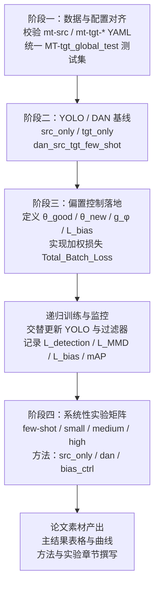

### 实验二（YOLO 钢材缺陷检测）实施计划：结合 MT 源 / 目标数据集

本文档对应 `Toy/ICML.md` 中的「2. 待进行的工作 (Next Steps / Future Work)」，在 **DAN/config** 下已有的数据集配置基础上，把后续工作拆解为可直接执行的实验与工程步骤。

---

### 1. 数据集与场景映射

**1.1 源域 (Source)**

- **配置文件**：`DAN/config/mt-src-dataset.yaml`  
- **路径结构**：  
  - `path: /root/autodl-tmp/dataset/MT_src_options/0_full_source`  
  - `train: MT-src_train/images`  
  - `val: MT-src_val/images`  
- **语义**：完整的工业缺陷 **源域** 数据集，用于训练「黄金标准模型」和源域基线。

**1.2 目标域 (Target) – 多种标签规模**

- **few-shot 场景**（极少标签 + 统一测试集）
  - **配置文件**：`DAN/config/mt-tgt-few-shot.yaml`  
  - `train: /root/autodl-tmp/dataset/MT-tgt-split/MT-tgt_few-shot_train/images`  
  - `val:   /root/autodl-tmp/dataset/MT-tgt-split/MT-tgt_few-shot_val/images`  
  - `test:  /root/autodl-tmp/dataset/MT-tgt-split/MT-tgt_global_test/images`  
  - **作用**：构造「极少量有标签 + 大量分布漂移」的目标域场景；`MT-tgt_global_test` 建议作为 **所有实验的统一评测集**。

- **small / medium / high 场景**（不同标签量）
  - **配置文件**：  
    - `DAN/config/mt-tgt-small.yaml` → `MT-tgt_small_train`  
    - `DAN/config/mt-tgt-medium.yaml` → `MT-tgt_medium_train`  
    - `DAN/config/mt-tgt-high.yaml` → `MT-tgt_high_train`  
  - **典型结构**（以 small 为例，medium / high 类似）：  
    - `path: /root/autodl-tmp/dataset/MT-tgt-split/MT-tgt_small_train`  
    - `train: images`  
    - `val:   images`  
  - **语义**：在目标域中依次增加标注数量，用于对比「few-shot → small → medium → high」下方法的稳定性与收益。

**1.3 后续所有实验的统一约定**

- 统一测试集：`/root/autodl-tmp/dataset/MT-tgt-split/MT-tgt_global_test/images`  
  - few-shot 配置中已给出 `test`，建议为 **所有源 / 目标 / 域适应 / 偏置控制实验的统一评估集**。  
- 类别数与类别名称：所有 YAML 中 `nc` 与 `names` 已保持一致（6 类：`chamfer`, `multifaceted`, `bump`, `impurity`, `crack`, `grind`），可直接共用同一 YOLO 检测头。

---

### 2. 实验总体框架：从基线到偏置控制

我们将 `Toy/ICML.md` 中的「实验二」具体化为四个阶段：

1. **数据与配置对齐**：确保所有 YAML 和实际目录结构一致，可被 YOLO / DAN 正常加载。  
2. **YOLO / DAN 基线实验**：在不同标签规模下建立源域 / 目标域 / 域适应基线。  
3. **偏置控制递归训练 (L_bias + 过滤器)**：在 YOLO 训练循环中落地我们的新理论框架。  
4. **系统性对比实验与论文素材产出**：在 MT-tgt_global_test 上形成完整的实验矩阵与可视化结果。

下面按阶段细化「Next Steps / Future Work」需要完成的具体部分。

---

### 3. 阶段一：数据与配置对齐（工程准备）

**3.1 目录与 YAML 校验**

- 使用 `DAN/config/mt-src-dataset.yaml` 与 4 个目标域 YAML，对照实际目录：  
  - 检查 `path/train/val(/test)` 目录是否存在、图片与标签是否匹配。  
  - 重点确认 `MT-tgt_small_train`, `MT-tgt_medium_train`, `MT-tgt_high_train` 下是否存在：  
    - `images/` 与 `labels/` 子目录  
    - `val` 阶段是否需要单独拆分（当前 YAML 中 `train: images`, `val: images`，如有需要可考虑在同一目录中通过文件列表划分 Train/Val）。

**3.2 统一测试集配置**

- 从 `mt-tgt-few-shot.yaml` 中抽出全局测试集：  
  - `test: /root/autodl-tmp/dataset/MT-tgt-split/MT-tgt_global_test/images`  
- 新增或复用一个统一测试 YAML（可选）：  
  - 例如：`DAN/config/mt-tgt-global-test.yaml`  
  - 仅用于评估阶段，指向上述 `test` 目录，保证所有实验的评估集完全一致。

**3.3 实验场景命名规范**

- 建议以「源 / 目标标签量 / 方法类型」组合命名实验场景，方便在 `Results/` 中管理：  
  - `src_only`：仅用 `mt-src-dataset.yaml` 训练，在 `MT-tgt_global_test` 上评估。  
  - `tgt_few_shot_only`, `tgt_small_only`, `tgt_medium_only`, `tgt_high_only`：目标域标签不同规模的纯目标训练。  
  - `dan_src_tgt_few_shot`：使用 `mt-src-dataset.yaml` + `mt-tgt-few-shot.yaml` 的 DAN 域适应基线。  
  - 后续偏置控制实验：`bias_ctrl_*`（详见第 5 节）。

---

### 4. 阶段二：YOLO / DAN 基线实验

这一阶段对应 ICML 方案中的「Baseline A / 传统方法」，目标是为后续偏置控制方法提供对比基准。

**4.1 源域 YOLO 黄金标准模型 (θ_good)**

- **数据**：`DAN/config/mt-src-dataset.yaml`  
- **目标**：训练一个在源域和目标域上表现较好的 YOLO（或 YOLO12 + DAN）模型，作为理论中的「黄金标准」$\theta_{good}$。  
- **实验要点**：  
  - 在源域验证集上达到稳定收敛（避免明显欠拟合 / 过拟合）。  
  - 在 `MT-tgt_global_test` 上记录 mAP / F1 等指标（作为后续「偏置控制是否改善」的参考上界）。

**4.2 纯目标域基线（不同标签量）**

使用 4 个目标域 YAML，在不启用域适应、不启用偏置控制的情况下训练 YOLO 基线：

- **few-shot**：`mt-tgt-few-shot.yaml` → 极少标签 + 全局测试集。  
- **small / medium / high**：`mt-tgt-small.yaml`, `mt-tgt-medium.yaml`, `mt-tgt-high.yaml`。  

每个场景记录：

- 在目标域验证集 / `MT-tgt_global_test` 上的 mAP / F1 曲线。  
- 训练收敛速度、是否出现「合成数据 / 有偏数据导致的模型坍塌」。

**4.3 DAN 域适应基线**

- **数据组合**：  
  - 源域：`mt-src-dataset.yaml`  
  - 目标域：建议从 `mt-tgt-few-shot.yaml` 开始（few-shot + 全局测试集）。  
- **目标**：得到一个「只用 MMD 域适应，不用 L_bias / 过滤器」的标准域适应基线。  
- **实验输出**：  
  - `Results/dan_src_tgt_few_shot/seed_*/results.csv`  
  - 源 / 目标域上的 mAP 曲线，用于对比「仅 MMD」 vs 「MMD + 偏置控制」。

---

### 5. 阶段三：偏置控制递归训练在 YOLO / DAN 中的落地

这一阶段对应 `Toy/ICML.md` 中 **2.A 实验二** 的主要内容，把理论中的 $\theta_{good}$, $L_{bias}$, $g_{\phi}$, $w_i$ 具体化到 MT 源 / 目标数据集上。

**5.1 定义核心对象**

- **黄金标准模型 $\theta_{good}$**：  
  - 来源：第 4.1 节中在源域上训练得到的最佳 YOLO / DAN 模型（例如 `Results/src_only/seed_*/weights/best_src.pt`）。  
- **当前模型 $\theta_{new}$**：  
  - 在各个目标域场景 (few-shot / small / medium / high) 上训练的 YOLO / DAN 模型。  
- **过滤器 $g_{\phi}$（独立 MLP）**：  
  - 输入：针对每个样本 / 每个 mini-batch 构造的「特征 + 误差信号」，例如：  
    - YOLO backbone 的中层特征（来自 `DAN/src/models`）；  
    - 当前模型在该样本上的损失 / 置信度统计量。  
  - 输出：每个样本的权重 $w_i \in [0, 1]$，控制该样本在本次更新中的影响力。  
- **偏置损失 $L_{bias}$**：  
  - 用于约束「当前模型」不会偏离 `θ_good`：  
    - 例如：在参数空间上：$L_{bias} = \|\theta_{new} - \theta_{good}\|^2$；  
    - 或在特征 / 输出空间上：让当前模型的特征 / 预测不偏离黄金模型（更适合目标检测场景）。  

**5.2 训练目标函数实现**

在现有 YOLO / DAN 损失基础上，引入样本权重和偏置项：

- **样本权重化损失**：  
  - 将 ICML 方案中的权重 $w_i$ 用在 **损失层面**：  
  - `Total_Batch_Loss = Σ_i w_i · Loss_YOLO(x_i)`  
  - 在代码层面，需要修改：  
    - 数据 Loader / Batch 结构，使得每个样本携带一个 `weight` 字段；  
    - 损失汇总逻辑，按样本权重加权平均。

- **整体目标函数**：  
  - `L_total = L_detection + λ_da · L_MMD + λ_bias · L_bias`  
  - 其中：  
    - `L_detection`：YOLO 检测损失 (box + cls + dfl)。  
    - `L_MMD`：现有 DAN 中已实现的 MMD 域适应损失。  
    - `L_bias`：对齐 $\theta_{good}$ 的偏置损失（参数空间 / 特征空间均可尝试）。  
    - `λ_da`, `λ_bias`：在 `dan_training_config.json` 中新增或扩展超参数。

**5.3 递归训练流程设计**

在每个场景（few-shot / small / medium / high）上执行以下递归过程：

1. **初始化**：  
   - 加载 `θ_good` 作为起点，或作为额外的「教师模型」。  
2. **阶段性训练 YOLO / DAN**：  
   - 使用当前过滤器 $g_{\phi}$ 输出的权重 $w_i$，进行若干 epoch 的加权训练。  
3. **更新过滤器 $g_{\phi}$**：  
   - 基于 `L_bias` 与任务损失，反向传播更新 $g_{\phi}$，学习「应当信任哪些目标域样本」。  
4. **监控指标**：  
   - 记录每一阶段的：`L_detection`, `L_MMD`, `L_bias`, 平均 $w_i$ 分布，以及在 `MT-tgt_global_test` 上的 mAP。  
5. **重复递归**：  
   - 直到收敛或达到预设阶段数，绘制类似 `Toy/ICML.md` 中「实验一 v2 金钱图」的曲线，但横轴改为 epoch / 阶段，纵轴为 mAP / L_bias。

---

### 6. 阶段四：系统性实验矩阵与论文素材产出

在 MT 源 / 目标数据集上，构造清晰的实验矩阵，对比「传统方法」与「偏置控制方法」。

**6.1 实验矩阵设计**

以 `MT-tgt_global_test` 为统一测试集，至少覆盖以下组合：

- 方法维度：  
  - `src_only`（源域 YOLO）  
  - `tgt_only`（few-shot / small / medium / high 各自纯目标训练）  
  - `dan`（仅 MMD 域适应）  
  - `bias_ctrl`（MMD + L_bias + 过滤器）  
- 数据维度：  
  - few-shot / small / medium / high 四种标签规模  
  - 可选：不同随机种子 (seed_1088 等)，用于展示稳定性。

**6.2 结果可视化与分析**

- 在 `DAN/Results/` 目录下收集：  
  - `results.csv`, `metrics_summary.json`, `plots/` 中的训练曲线；  
  - 对 key 指标 (mAP, recall, calibration 等) 进行对比绘图。  
- 重点展示：  
  - **有偏合成数据存在时**，传统方法如何被「坏样本」拖向错误的收敛点；  
  - 加入 **L_bias + 过滤器** 后，模型如何保持接近 `θ_good` 的表现（L_bias 下降、mAP 提升 / 稳定）。

**6.3 论文撰写骨架**

- 数据与任务描述：MT 源 / 目标数据集、缺陷类别、few-shot / small / medium / high 的定义。  
- 方法章节：  
  - 简述 DAN + MMD 范式；  
  - 引出偏置控制锚点 $L_{bias}$ 和样本过滤器 $g_{\phi}$；  
  - 给出完整损失函数与训练流程图。  
- 实验章节：  
  - 按第 6.1 节的实验矩阵，组织主表格与消融实验；  
  - 对比不同标签规模下的收益与稳定性。

---

### 7. Mermaid 计划可视化

---

### 8. 与 Toy/ICML.md 的对应关系小结

- `Toy/ICML.md` 中「2.A 实验二 (YOLO 钢材缺陷检测)」在本文件中被拆解为：  
  - 阶段一：用 `mt-src-dataset.yaml` + `mt-tgt-*.yaml` 实例化「θ_good + 有偏目标域」设定；  
  - 阶段二：构建 YOLO / DAN 的基线实验（对应原文中的 Baseline A）；  
  - 阶段三：在 MT 源 / 目标数据集上落地 $L_{bias}$ 和过滤器 $g_{\phi}$，形成「加权损失 + 递归训练」；  
  - 阶段四：形成可直接写入 ICML 论文的实验矩阵与可视化结果。  

这样，后续只需沿着本文件的阶段 1–4 逐步实现和跑完实验，即可完成 ICML 方案中最关键的「实验二：真实世界 YOLO 钢材缺陷检测」部分。

