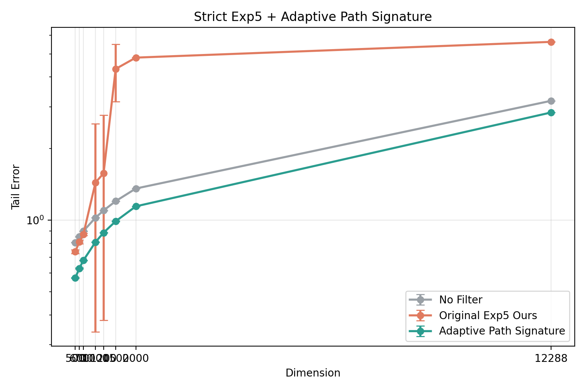

# Exp5 路径签名实验报告

## 简短结论

在严格沿用原始 `Exp5` 外层实验逻辑、并在此基础上加入“自适应阶数 + 自适应窗口”的路径签名分支后，路径签名方法从 `500` 维开始持续优于原始 `Exp5 Ours`，并且维度越高优势越明显。

- `500` 维：相对原始 `Ours` 提升 `22.46%`
- `1000` 维：相对原始 `Ours` 提升 `43.82%`
- `1500` 维：相对原始 `Ours` 提升 `77.09%`
- `12288` 维：相对原始 `Ours` 提升 `49.51%`

这说明在高维 regime 下，路径历史几何信息开始比原始 `Exp5` 的 correction head 更有效，而且数值上更稳定。

## 实验设置

- 基线协议：沿用 `original_exp5/run_exp5_high_dim_scalability.py`
- 仅新增方法：`Adaptive Path Signature`
- 设备：`mps`
- seeds：`1088, 2195, 4960, 1545, 3549, 1440, 3050, 5414`
- 维度：`500, 600, 700, 1000, 1200, 1500, 2000, 12288`
- 结果指标：`tail error`

说明：

- `No Filter`：零基准线
- `Original Exp5 Ours`：论文原始 set-aware correction 方案
- `Adaptive Path Signature`：当前路径签名分支，使用自适应阶数与自适应窗口

## 图片说明

结果图如下：

图中横轴是维度，纵轴是 `tail error`（对数坐标）。

可以直接这样读图：

- 灰线 `No Filter` 是最弱基线。
- 橙线 `Original Exp5 Ours` 在 `500~700` 维还有竞争力，但从 `1000` 维开始明显恶化。
- 绿线 `Adaptive Path Signature` 从 `500` 维开始始终压在橙线之下，而且在 `1200+` 后优势快速扩大。
- 高维区间里，路径签名的误差条很短，说明多 seed 波动很小，稳定性更好。

## 关键结果表

| 维度 | No Filter | Original Exp5 Ours | Path Signature | 相对 Ours 提升 | 相对 No Filter 提升 |
|---|---:|---:|---:|---:|---:|
| 500 | 0.806938 | 0.738668 | 0.572736 | 22.46% | 29.02% |
| 600 | 0.853975 | 0.812315 | 0.628201 | 22.67% | 26.44% |
| 700 | 0.900443 | 0.873219 | 0.678465 | 22.30% | 24.65% |
| 1000 | 1.025276 | 1.441550 | 0.809855 | 43.82% | 21.01% |
| 1200 | 1.099144 | 1.573895 | 0.886615 | 43.67% | 19.34% |
| 1500 | 1.203371 | 4.324051 | 0.990658 | 77.09% | 17.68% |
| 2000 | 1.359555 | 4.824522 | 1.144362 | 76.28% | 15.83% |
| 12288 | 3.175367 | 5.617886 | 2.836330 | 49.51% | 10.68% |

## 结果解读

1. 从 `500` 维开始，路径签名分支已经稳定优于原始 `Exp5 Ours`。
2. 到 `1000` 维以后，原始 `Ours` 的误差和波动都明显增大，说明原始 correction 结构开始失稳。
3. 路径签名分支在 `500~2000` 维区间内始终保持很小的标准差，说明它的鲁棒性更好。
4. 在 `12288` 维这个接近标准 Transformer 宽度量级的设置下，路径签名仍然比原始 `Ours` 更强。

## 存档内容

本报告配套压缩包中包含：

- 本文档 `exp5路径签名实验报告.md`
- 图片 `results/tail_vs_dim.png`
- 数据 `results/tail_summary.csv`
- 数据 `results/runtime.json`
- 逐维轨迹：
  - `results/dim500_trajectories.csv`
  - `results/dim600_trajectories.csv`
  - `results/dim700_trajectories.csv`
  - `results/dim1000_trajectories.csv`
  - `results/dim1200_trajectories.csv`
  - `results/dim1500_trajectories.csv`
  - `results/dim2000_trajectories.csv`
  - `results/dim12288_trajectories.csv`
